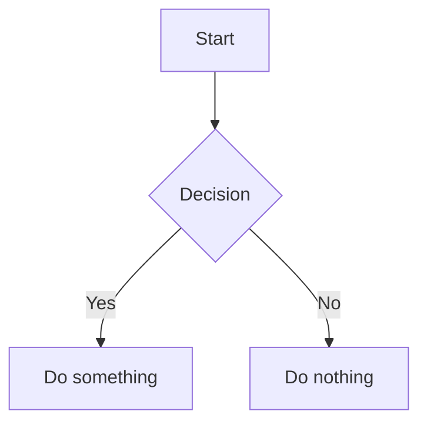
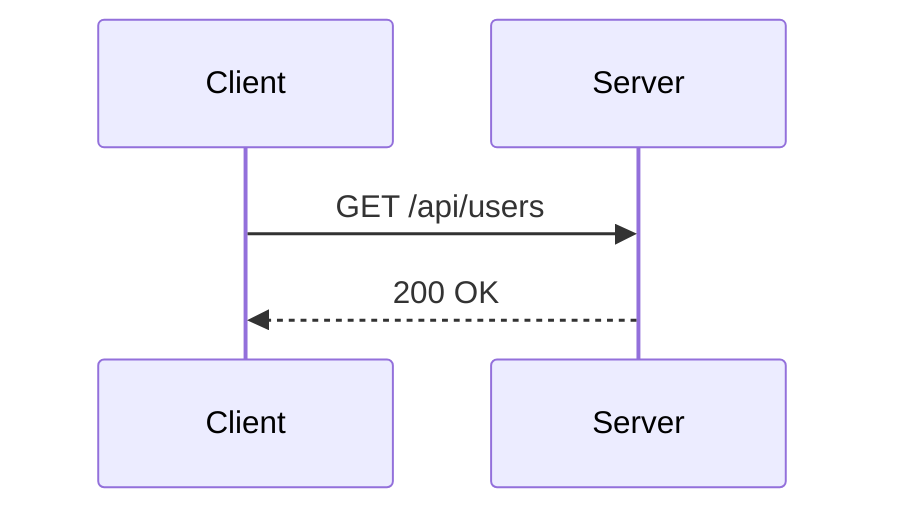
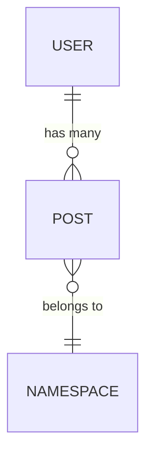

# Thinkstream Markdown Syntax Guide

Use this guide when formatting Scrap note content. Prefer these constructs over plain prose where they add clarity.

---

## Critical Rule: URLs Must Be Standalone

**Never place a URL on the same line or in the same paragraph as other text.**

Wrong:

```
See the implementation here: https://github.com/owner/repo/blob/main/src/Foo.php#L10-L20
```

Wrong:

```
1. Step description. https://github.com/owner/repo/blob/main/src/Foo.php#L10-L20
```

Correct — use `@[github]()` on its own line:

```
@[github](https://github.com/owner/repo/blob/main/src/Foo.php#L10-L20)
```

Correct — or place the bare URL as a standalone paragraph (blank line before and after):

```
Step description.

https://github.com/owner/repo/blob/main/src/Foo.php#L10-L20
```

---

## Embeds

### GitHub Code Embed

Renders the file inline with syntax highlighting. Supports line ranges.

```
@[github](https://github.com/owner/repo/blob/branch/path/to/file.php)
@[github](https://github.com/owner/repo/blob/branch/path/to/file.php#L42)
@[github](https://github.com/owner/repo/blob/branch/path/to/file.php#L10-L30)
```

### Link Card

Renders an OGP preview card for any URL.

```
@[card](https://example.com/some/page)
```

Any standalone `https://` URL (not GitHub) also becomes a link card automatically.

### YouTube

Place the YouTube URL alone on its own paragraph — it embeds automatically.

```
https://www.youtube.com/watch?v=dQw4w9WgXcQ
```

---

## Callout Blocks

```
:::message
Default info callout.
:::

:::message note
Neutral note.
:::

:::message tip
Helpful tip.
:::

:::message alert
Warning or caution.
:::

:::message check
Success or confirmation.
:::
```

---

## Collapsible Section

```
:::details Click to expand
Hidden content goes here.
:::
```

---

## Code Blocks

Standard with language:

````
```php
echo "hello";
```
````

With filename:

````
```php:src/Console/Add.php
echo "hello";
```
````

Diff (prefix lines with `+` added / `-` removed):

````
```diff php
- old line
+ new line
```
````

---

## Standard Markdown

Use standard GFM for everything else: headings (`##`, `###`), ordered/unordered lists, bold/italic, inline code, blockquotes, and tables.

Tables:

```
| Column A | Column B |
|----------|----------|
| value    | value    |
```

---

## Callouts (Mintlify style)

These are aliases for the `:::message` callout blocks above. Use whichever form reads more naturally.

```
<Note>
Neutral note.
</Note>

<Tip>
Helpful tip.
</Tip>

<Info>
Default info callout.
</Info>

<Warning>
Warning or caution.
</Warning>

<Check>
Success or confirmation.
</Check>
```

---

## Cards

Cards display a title, optional icon, optional description, and optional link.

```
<CardGroup cols={2}>
  <Card title="Getting Started" icon="rocket" href="/docs/start">
    A short description of this card.
  </Card>
  <Card title="Reference" icon="code">
    Cards without href are non-clickable.
  </Card>
</CardGroup>
```

`cols` defaults to `2`. Supported values: `1`, `2`, `3`, `4`.

`icon` accepts Lucide icon names (`rocket`, `lock`, `zap`, `settings`, `user`, `database`, `code`, `search`, `star`, `mail`, `calendar`, `clock`, `brain`, `sparkles`, `leaf`, etc.) or Simple Icons brand names (e.g. `laravel`, `github`, `typescript`).

Self-closing card (no body):

```
<Card title="Link only" icon="arrow-right" href="/path" />
```

`<Columns>` is an alias for `<CardGroup>`:

```
<Columns>
  <Card title="Left">...</Card>
  <Card title="Right">...</Card>
</Columns>
```

---

## Tabs

````
<Tabs>
  <Tab title="PHP">

```php
echo "hello";
````

  </Tab>
  <Tab title="JavaScript">

```js
console.log('hello');
```

  </Tab>
</Tabs>
```

Tabs with the same `title` across multiple `<Tabs>` blocks on the page stay in sync automatically (selection is persisted in localStorage).

---

## Steps

Numbered step list with optional titles.

```
<Steps>
  <Step title="Install dependencies">
    Run `npm install`.
  </Step>
  <Step title="Configure environment">
    Copy `.env.example` to `.env` and fill in the values.
  </Step>
  <Step>
    Steps without a title show only the number badge.
  </Step>
</Steps>
```

---

## Accordion

Collapsible section. Alias for `:::details`.

```
<Accordion title="Click to expand">
Hidden content goes here.
</Accordion>
```

---

## Code Group

Tabbed code blocks. Code blocks inside are grouped into tabs by filename or language. Tabs with the same title across groups on the page stay in sync.

````
<CodeGroup>
```php:app/Models/User.php
class User extends Model {}
````

```js:resources/js/app.js
import './bootstrap';
```

</CodeGroup>
```

---

## API Fields

### ResponseField

Documents a response body field.

```
<ResponseField name="id" type="string" required>
  The unique identifier for the resource.
</ResponseField>

<ResponseField name="created_at" type="string" deprecated default="null">
  ISO 8601 timestamp. Deprecated — use `timestamp` instead.
</ResponseField>
```

Attributes: `name`, `type`, `required` (flag), `deprecated` (flag), `default`.

### ParamField

Documents a request parameter. The location attribute (`path`, `query`, or `body`) doubles as the parameter name when `name` is omitted.

```
<ParamField path="id" type="string" required>
  The resource ID in the URL path.
</ParamField>

<ParamField query="page" type="integer" default="1">
  Page number for pagination.
</ParamField>

<ParamField body="email" type="string" required>
  The user's email address.
</ParamField>
```

---

## Update (Changelog)

Timeline entry for changelogs and release notes.

```
<Update label="v2.1.0" description="2024-06-01" tags="new,breaking">
  - Added dark mode support.
  - **Breaking**: renamed `color` prop to `variant`.
</Update>

<Update label="v2.0.0" description="2024-04-15" tags="release">
  Initial stable release.
</Update>
```

`label` becomes the anchor link target. `tags` is a comma-separated list shown as badges.

---

## Badge (inline)

Inline status/label badges.

```
Status: <Badge color="green">Stable</Badge>

<Badge color="red" shape="pill">Deprecated</Badge>

<Badge color="blue" size="sm" stroke>New</Badge>

<Badge color="orange" icon="zap">Beta</Badge>
```

**`color`**: `gray` (default), `blue`, `green`, `yellow`, `orange`, `red`, `purple`, `white`, `surface`, `white-destructive`, `surface-destructive`

**`size`**: `xs`, `sm`, `md` (default), `lg`

**`shape`**: `rounded` (default), `pill`

**`stroke`**: outline-only variant (flag attribute)

**`disabled`**: grayed-out appearance (flag attribute)

**`icon`**: Lucide or Simple Icons icon name

---

## Tooltip (inline)

Hover tooltip on a word or phrase.

```
The <Tooltip tip="A runtime environment for JavaScript">Node.js</Tooltip> server handles requests.

<Tooltip tip="Requests per minute" headline="Rate limit" cta="See docs" href="/docs/rate-limits">RPM</Tooltip>
```

`tip` is required. `headline` adds a bold title inside the tooltip. `cta` + `href` adds a link.

---

## Tree

Visual file/folder tree. Two equivalent syntaxes:

### Fenced code block (ASCII tree)

````
```tree
src/
├── index.ts
└── components/
    ├── Button.tsx
    └── Input.tsx
package.json
```
````

The ASCII tree is parsed from `tree`-fenced code blocks. Lines beginning with `.` are treated as the root directory marker.

### JSX tags

```
<Tree>
  <Tree.Folder name="src" defaultOpen>
    <Tree.File name="index.ts" />
    <Tree.Folder name="components">
      <Tree.File name="Button.tsx" />
      <Tree.File name="Input.tsx" />
    </Tree.Folder>
  </Tree.Folder>
  <Tree.File name="package.json" />
</Tree>
```

`defaultOpen` on a `Tree.Folder` makes it expanded by default. `openable={false}` disables click-to-toggle.

---

## Quiz

Interactive multiple-choice question in a `quiz`-fenced code block.

````
```quiz
question: Which command installs Composer dependencies?
A: npm install
B: composer install
C: php artisan install
correct: B
hint: Think about the PHP package manager.
explanation: Composer is the PHP dependency manager. `composer install` reads composer.json.
```
````

Required: `question`, at least two options (`A:`, `B:`, …), `correct` (the option label).

Optional: `hint` (shown on request), `explanation` (shown after answering), `incorrect` (custom message for wrong answers), `correctMessage` (custom message for correct answer).

---

## Charts

データをグラフで表示する fenced code block。

````
```chart:bar
_title: Flavor Profile
_max: 10
juniper: 9
citrus: 4
spice: 6
herbal: 5
floral: 2
sweetness: 2
smoothness: 5
```
````

````
```chart:radar
_title: Flavor Profile
_max: 10
juniper: 9
citrus: 4
spice: 6
herbal: 5
floral: 2
sweetness: 2
smoothness: 5
```
````

Reserved keys (`_` prefix): `_title`（チャートタイトル）、`_max`（軸の最大値）、`_min`（軸の最小値）。  
それ以外の `label: 数値` 行がデータポイント。`chart:bar` は横棒グラフ、`chart:radar` はレーダーチャート。

---

## Mermaid Diagrams

Fenced code block with `mermaid` as the language.

````

````

````

````

````

````

All standard Mermaid diagram types are supported (flowchart, sequence, ER, Gantt, pie, class, state, etc.). Diagrams render in light/dark mode automatically.

---

## Text Highlight

Wrap text in `==` to render as `<mark>` (highlighted).

```
This is ==highlighted== text.
```

---

## Images

### Size

Append `=WIDTHxHEIGHT` (pixels) inside the image URL parentheses. Either dimension may be omitted.

```


```

### Caption

Place an italic line (`*caption*`) immediately after the image line. It is rendered as a visible caption below the image.

```

*Figure 1: the login screen*
```
